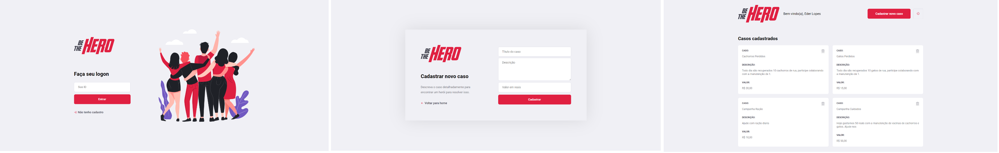
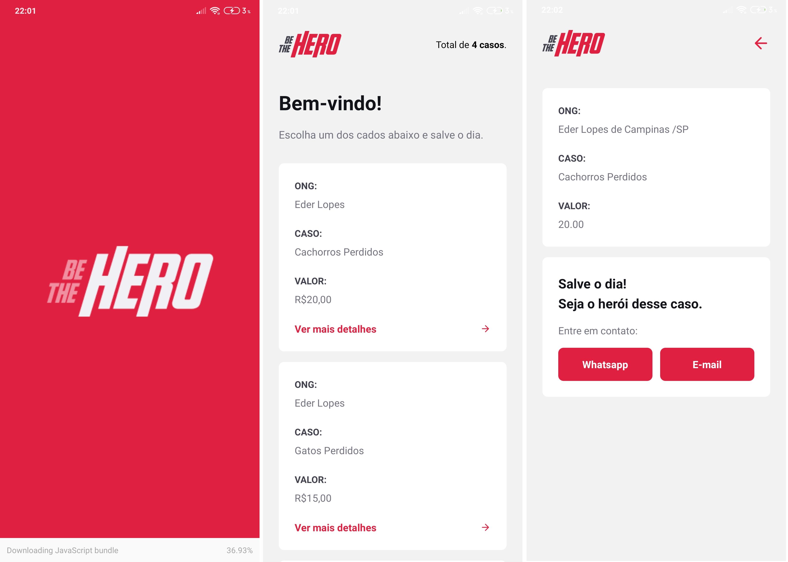

<h4 align="center">
    
     
    <b>Seja um verdadeiro Heroi!</b> 🦸‍
</h4>

<h2 align="center">
   
  🚀 Semana Omnistack 11.0
</h2>

## 💻 Projeto

O **Be The Hero** é um projeto que visa conectar pessoas interessadas em ajudar ONGs e ONGs com campanhas abertas.

The **Be The Hero** is a project to connect people interested in helping ONGs and ONGs with open campaigns.

  &nbsp;&nbsp;&nbsp;|&nbsp;&nbsp;&nbsp; 
  <a href="#rocket-tecnologias">Tecnologias</a>&nbsp;&nbsp;&nbsp;|&nbsp;&nbsp;&nbsp;
  <a href="#-projeto">Projeto</a>&nbsp;&nbsp;&nbsp;|&nbsp;&nbsp;&nbsp;

## :camera: Veja:

### Frontend

### Mobile

## :rocket: Tecnologias

Esse projeto foi desenvolvido com as seguintes tecnologias:

- [Node.js](https://nodejs.org/en/)
- [React](https://reactjs.org)
- [React Native](https://facebook.github.io/react-native/)
- [Expo](https://expo.io/)

Extras:

- Libs
  - [Express](https://expressjs.com/pt-br/)
  - [KnexJS](http://knexjs.org/)
  - [JestJS](https://jestjs.io/)
- Estilos
  - [EditorConfig](https://editorconfig.org/)
  - [ESLint](https://eslint.org/)
  - [Prettier](https://prettier.io/)
